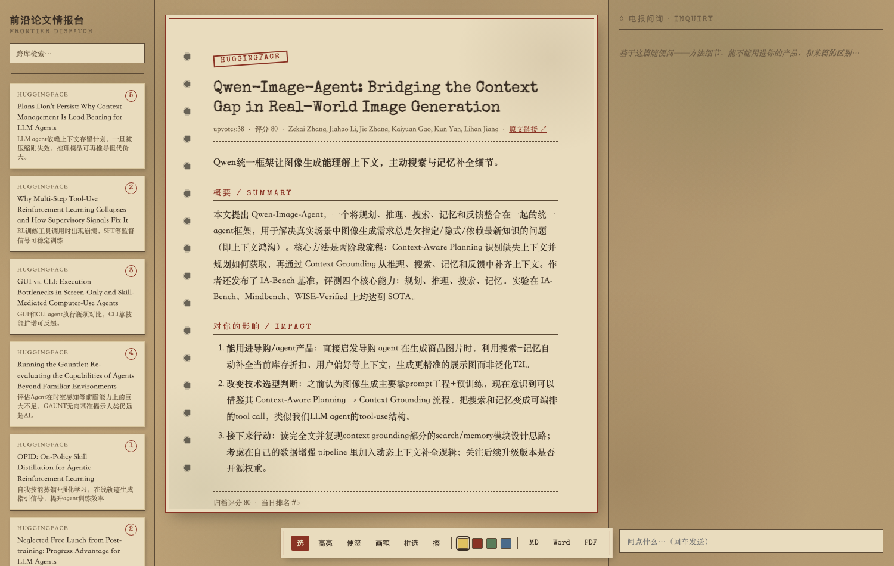
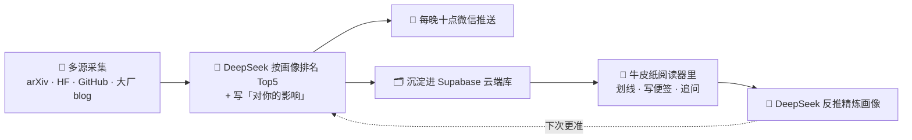
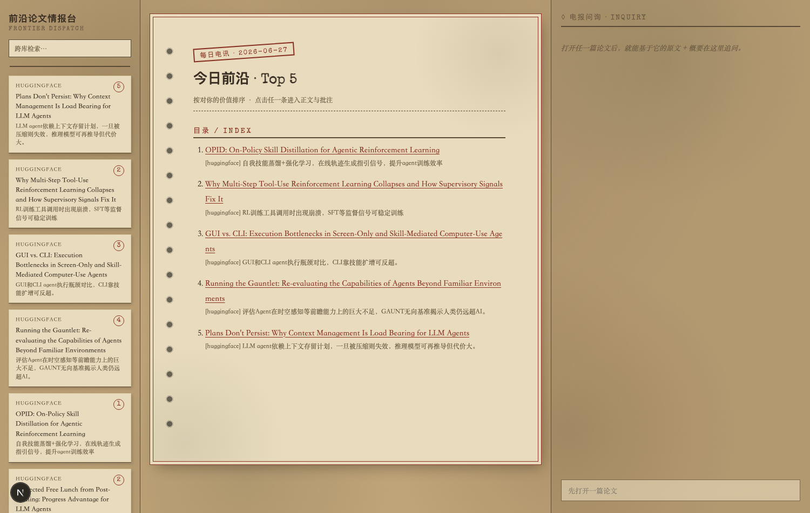
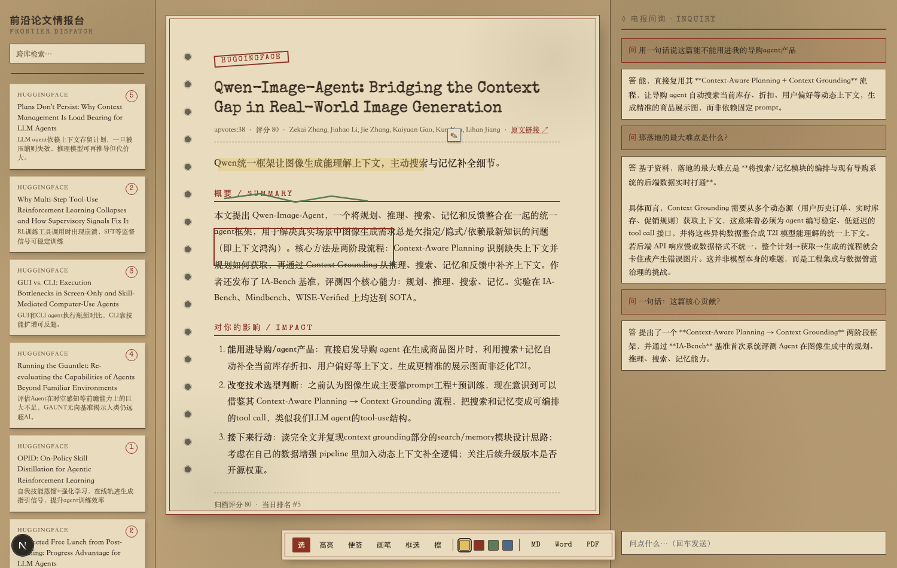
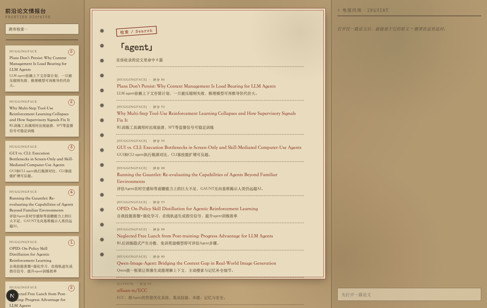
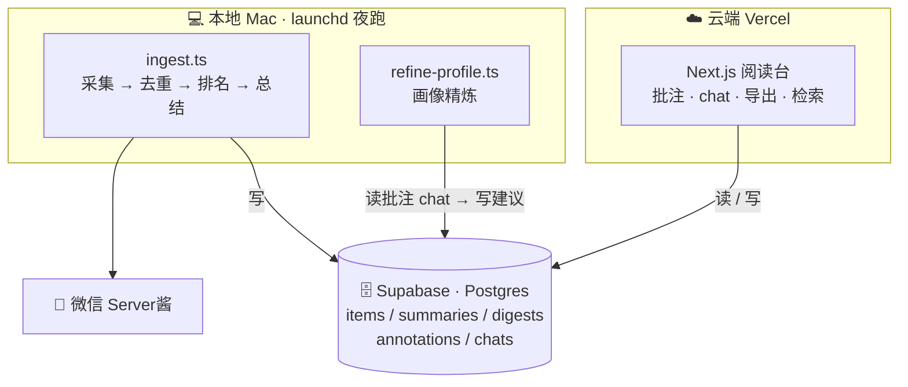

# 🗞️ 前沿论文情报台 · Frontier Paper Dispatch

> 一台**懂你**的前沿论文情报机。不是把同一份摘要群发给所有人——而是按 **你的画像** 给每天的 arXiv / HuggingFace / GitHub / 大厂官方 blog 排名、为每篇写「**对你的影响**」，沉淀进一个 **可检索、可批注、可对话** 的私人情报库，并随你的使用 **越用越懂你**。

> 📡 多源采集 · 🎯 画像加权排名 · 📨 每晚十点微信推送 Top5 · 📖 复古牛皮纸阅读台 · 🔁 自进化飞轮


> 🔗 **在线体验（只读 Demo）**：**[frontier-paper-dispatch-demo.vercel.app](https://frontier-paper-dispatch-demo.vercel.app)** — 无需登录直接逛；问答/批注等写操作在 demo 里只读（也不会烧任何 API 额度）。



---

## 🤔 和「AI 新闻摘要工具」有什么不同？

大多数「AI 资讯 / 论文摘要」做的是：抓一批热门 → 生成通用摘要 → 群发。**前沿论文情报台** 从根上不同：

| | 普通摘要 + 推送 | 🗞️ 前沿论文情报台 |
|---|---|---|
| **排序** | 千人一面，按热度 / 时间 | **千人千面**：DeepSeek 按你的画像打分，并为每篇写「对你的影响」 |
| **信息留存** | 推完即逝，看过就丢 | **沉淀进云端库**：全文检索 · 原文批注 · 二次问答 · md/pdf/word 导出 |
| **是否进化** | 静态规则，永远一个样 | **自进化飞轮**：你的批注 / 提问被反推成更准的画像，越用越懂你 |
| **阅读体验** | 朴素列表 / 邮件 | **复古牛皮纸** 沉浸式阅读：装订孔 · 火漆印章 · 打字机字体 · 电报问询 |

一句话：别人给你 **资讯**，它给你 **情报**——只与你相关、且会积累和进化的那种。✨

---

## 🔁 核心：越用越懂你的飞轮

普通工具是一条直线（抓取 → 摘要 → 推送 → 结束）。这里是一个 **闭环**：



你读得越多、划得越多、问得越多 → 画像越精准 → 明天的 Top5 越戳你。**这是它和「又一个摘要器」的本质区别。**

---

## 🖼️ 界面一览

> 设计语言：**复古电报 / 牛皮纸做旧**——分层霉斑、装订孔、双线边框、火漆红印章、打字机字体（Special Elite + Noto Serif SC）。固定宽「纸张」既是美学，也让批注坐标稳定。

**🗞️ 每日电讯 · Top5 封面**



**✍️ 原文批注 + 右栏二次问答**（高亮 / 便签 / 画笔 / 框选，持久化；右栏基于这篇论文追问，满上下文不做 RAG）



**🔍 跨库检索**（在你收录的全部论文里搜，中英通）



---

## 🏗️ 架构：本地采集 + 云端阅读（混合部署）



- **本地** 跑采集 + 排名 + 总结 + 推送：零托管成本、用你自己的 key、数据你掌控。
- **云端** 只放阅读台，随处可看；两边共享同一个 Supabase。

---

## 🚀 三分钟上手

### ① 零配置先尝个鲜（不需要任何 key）

```bash
git clone https://github.com/Looperswag/frontier-paper-dispatch.git
cd frontier-paper-dispatch
npm install
npm run ingest:dry      # 实时抓真实论文、去重、打印 Top 预览——不写库、不发信
```

> 🎁 这一步立刻看到今天 arXiv / HF / GitHub / 大厂 blog 的真实候选。`npm test` 跑去重单测。

### ② 接上完整流水线（采集 → 排名 → 微信推送）

1. `cp .env.example .env`，填 key：
   - `DEEPSEEK_API_KEY` — [platform.deepseek.com](https://platform.deepseek.com)
   - `SUPABASE_URL` / `SUPABASE_SERVICE_ROLE_KEY` — [supabase.com](https://supabase.com) 建项目
   - `SERVERCHAN_SENDKEY` — [sct.ftqq.com](https://sct.ftqq.com) 微信扫码（可选；不填则只写库不推送）
2. Supabase SQL Editor 执行 `supabase/migrations/0001_init.sql` 建表。
3. `cp config/profile.example.md config/profile.md`，按你的角色 / 项目 / 关注方向改——**排名和「对你的影响」全靠它**。
4. `npm run ingest`（写库不发信）/ `npm run ingest:send`（写库并推微信）。
5. 装定时（每晚 22:00 推送 + 每周日 23:00 画像精炼）：
   ```bash
   bash scripts/install-cron.sh
   ```

> ⚠️ **macOS 提醒**：项目别放 `~/Desktop`、`~/Documents`、`~/Downloads`——这些是隐私保护（TCC）目录，launchd 读不到文件、定时任务必失败。放 `~/frontier-paper-dispatch` 这类目录即可（`install-cron.sh` 会帮你拦截这种情况）。

### ③ 部署云端阅读台（可选）

```bash
cd web && npm install && npm run dev      # 本地 http://localhost:3000
```

随处访问：`cd web && bash deploy.sh`（一键 Vercel：link + 写 env + 部署）。

> 🔐 **公开部署必读**：本应用 **单用户设计、无内置登录**，所有写接口（chat 调 DeepSeek 花钱、批注增删）都未鉴权。公开部署务必二选一：开 **Vercel Deployment Protection**（需 Pro 套餐），或用仓库自带的 **middleware Basic Auth 口令门**——在 Vercel 设环境变量 `APP_PASSWORD` 即全站含所有 API 需口令（免费、零代码）。正式登录（Supabase Auth）见 Roadmap。

---

## 🔁 自进化：让它越来越懂你

```bash
npm run refine         # 读你的批注 + 提问 → DeepSeek 反推 → 生成 config/profile.suggested.md（不覆盖原文件）
npm run refine:apply   # 满意后套用（原 profile.md 自动备份为 .bak）
```

保留你写明的角色 / 项目，只优化关注方向并追加一节「## 观察到的偏好（自动）」。`install-cron.sh` 装的周任务会每周自动出一份建议，你有空瞄一眼采纳即可。

---

## 🧩 技术栈

| 层 | 选型 |
|---|---|
| 采集 / 排名 / 总结 | TypeScript + tsx；**DeepSeek**（OpenAI 兼容）`deepseek-chat` |
| 数据 | **Supabase**（Postgres）：items / summaries / digests / annotations / chats |
| 前端 | **Next.js 16**（App Router）+ 复古牛皮纸 CSS + SVG 批注层；marked + sanitize-html |
| 推送 / 部署 / 定时 | Server酱（微信） / Vercel / macOS launchd |
| 导出 | md · docx（`docx`）· pdf（打印 CSS） |

源数据可在 `config/sources.ts` 调（arXiv 分类、GitHub 主题、blog RSS 列表、每源上限、回看天数）。


---

## 📄 License

[MIT](LICENSE) © 2026 Looperswag
