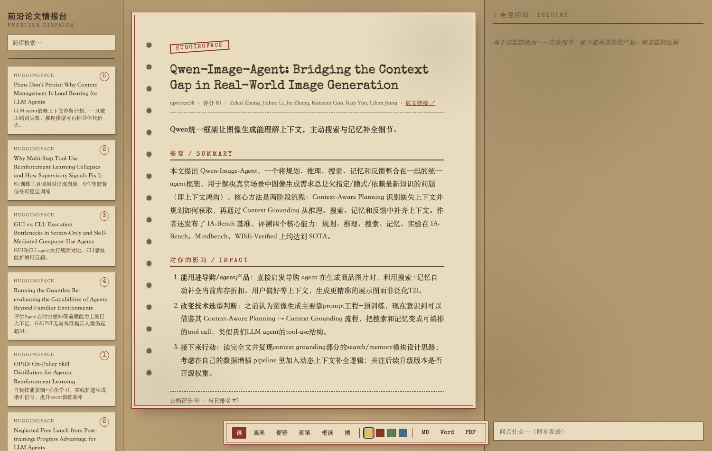

# Frontier Paper Dispatch · 前沿论文情报台

每天从可信论文、代码和官方研究博客中筛选候选内容，用 DeepSeek 结合个人画像与反馈生成 Top 5，保存到 Supabase，并通过 Server酱（可加 SMTP 邮件）推送。仓库同时提供仅 owner 可访问的 Next.js 阅读端。




## 5 分钟上手

需要 Node.js 20.19–25，推荐 Node.js 24。

### 1. 先看采集效果

这一步会访问公开信源，但不会调用 LLM、写数据库或发送消息：

```bash
git clone https://github.com/Looperswag/frontier-paper-dispatch.git
cd frontier-paper-dispatch
npm ci
npm run ingest:dry
```

来源按 best-effort 运行；单个来源临时为 0 或失败不会伪装成全局成功，也不会阻断其他健康来源。

### 2. 配置生产运行

```bash
cp .env.example .env
chmod 600 .env
cp config/profile.example.md config/profile.md
```

编辑 `config/profile.md`，并在 `.env` 中填写：

| 配置 | 作用与要求 |
|---|---|
| `DEEPSEEK_API_KEY` | `ingest`、`ingest:send` 和 `refine` 必需。 |
| `SUPABASE_URL`、`SUPABASE_SERVICE_ROLE_KEY` | 写库、投递和画像任务必需；service-role 只能在服务端使用。 |
| `WEB_BASE_URL`、`FEEDBACK_SECRET` | 生成和校验一次性反馈链接必需；前者只能是 origin，后者至少 32 字节。 |
| `SERVERCHAN_SENDKEY` | `ingest:send`、`push:last` 和默认定时任务必需。 |
| `ALERT_WEBHOOK_URL` | 手工运行时可不配；无人值守的 `doctor`、launchd 安装和云任务要求配置独立 HTTPS 告警。`ALERT_WEBHOOK_TOKEN` 可选。 |
| `OPENALEX_API_KEY` | 配置校验不强制，但 OpenAlex 稳定采集应使用官方免费 key；缺失时只有该来源可能降级。 |
| SMTP 七项 | 可选邮件副通道，必须成套配置；`SMTP_PASS` 使用邮箱授权码。 |
| `GITHUB_TOKEN` | 可选，用于提高 GitHub API 限额。 |

先做不回显密钥的检查：

```bash
npm run preflight -- --target ingest:send
```

旧变量可用 `npm run config:migrate` 迁移；迁移会保留 mode `0600` 的备份。

### 3. 初始化数据库并首次运行

必须应用仓库中的全部 migration：

```bash
npx supabase login
npx supabase link --project-ref <project-ref>
npx supabase db push

npm run ingest          # 生成并写库，不推送
npm run ingest:send     # 写库并投递微信；配置 SMTP 时同时发邮件
npm run push:last       # 重试最近一份仍有效简报的失败或未完成投递
```

同一天的摘要和简报在一个事务中写入；完全相同的重跑是 no-op，冲突内容和迟到旧任务会被拒绝。投递使用 outbox、租约、退避重试和幂等键，手工重放不会改写已成功渠道。

### 4. 启动私有 Web 阅读端（可选）

```bash
npm --prefix web ci
cp web/.env.example web/.env.local
chmod 600 web/.env.local
npm --prefix web run dev
```

`web/.env.local` 需填写示例文件列出的 Supabase、owner、DeepSeek、反馈和限流配置；`WEB_BASE_URL`、`FEEDBACK_SECRET` 必须与根 `.env` 一致。先在 Supabase Auth 创建并确认唯一 owner，再关闭公开注册和匿名登录。生产部署：

```bash
cd web
bash deploy.sh
```

阅读端提供最新简报、最近 60 篇有摘要内容的归档、最多 500 篇元数据/摘要关键词检索、反馈、批注、单篇问答，以及 Markdown、Word 和浏览器打印 PDF。它不抓论文 PDF 全文，也不提供向量/RAG 检索。

## macOS 定时任务

仓库必须位于稳定的本地路径（如 `~/Projects/frontier-paper-dispatch`），不要放在 `Desktop`、`Documents`、`Downloads` 或 iCloud/File Provider 目录。

```bash
npm run doctor
bash scripts/install-cron.sh
```

安装三个 LaunchAgent。plist 使用 Mac 本地时区，而流水线日期固定为 `Asia/Shanghai`，因此目标 Mac 应设置为上海时区：

| 任务 | 计划 | 作用 |
|---|---|---|
| `com.frontierpapers.ingest` | 每天 22:00；失败时每 15 分钟补跑；启动时检查遗漏 | `ingest:send` |
| `com.frontierpapers.refine` | 每周日 23:00；失败时每 30 分钟补跑；启动时检查遗漏 | 生成画像/选源建议 |
| `com.frontierpapers.deliver` | 每 15 分钟，并在启动时运行 | 重试 outbox；23:30 后检查缺失投递并发独立告警 |

周期唤醒和启动补跑都以计划日期为准；运行失败或新候选不足时不写成功标记，后续唤醒会重试，只有成功标记会让同一计划直接跳过。日志按 5 MiB × 3 轮转，当前和轮转文件均为 `0600`。安装、验证和完整卸载见 [launchd/安装说明.md](launchd/安装说明.md)。

## 信源

默认配置在 `config/sources.ts`，所有远程请求都有超时、总 deadline、响应大小和结构校验，并统一执行两天新鲜度门禁。

| 来源 | 状态 | 说明 |
|---|---|---|
| [arXiv RSS](https://info.arxiv.org/help/rss.html) | 启用 | AI/NLP/ML/CV/IR/多智能体分类，公平分配单轮结果。 |
| [Hugging Face Daily Papers](https://huggingface.co/papers) | 启用 | 论文发现与 upvotes。 |
| [GitHub Search](https://docs.github.com/en/rest/search/search) | 启用 | 分开检索新建与活跃仓库，并补充有限的 release 信息。 |
| [ACL Anthology](https://aclanthology.org/faq/news/) | 启用 | 仅精选 venue；会议批次之外返回 0 属正常。 |
| [OpenAlex](https://developers.openalex.org/api-reference/introduction) | 启用 | 近期 AI 论文及元数据；建议配置 `OPENALEX_API_KEY`。 |
| 官方研究博客 | 启用 | Hugging Face、DeepMind、Google Research、OpenAI、Anthropic、BAIR、Apple ML、Microsoft Research。 |
| OpenReview | 禁用 | 匿名全量端点存在 challenge 且混入评审；需认证和 venue-scoped 契约后再启用。 |
| Semantic Scholar / Crossref | 未启用增强 | 等待独立配额与有界批处理，或仅做精确 DOI 缓存查询。 |
| Google Scholar / X / Facebook | 不采集 | 不抓网页，也不把未实现来源计入健康度；Google Research 博客已在上表。 |

跨源内容按 arXiv、DOI、ACL、OpenReview 等稳定标识与受限 fallback 建立 canonical identity，保存来源观测，并过滤近期已成功投递的内容。

## 画像、运维与隐私

```bash
npm run refine          # 生成 profile.suggested.md；有反馈时也生成 scope.suggested.md
npm run refine:apply    # 重新生成后应用画像，并备份旧 profile.md
npm run state:backup    # 只备份画像和选源，不含密钥或数据库
```

反馈、批注和提问合计至少 3 条时才生成画像建议；选源建议始终需要手工审阅。数据位置、第三方披露、保留和删除边界见 [隐私说明](docs/privacy-data-lifecycle.md)，监控与恢复见 [运维文档](docs/operations/monitoring.md) 和 [备份/恢复](docs/operations/backup-restore.md)。可选的 GitHub Actions 定时任务默认关闭，见 [云调度说明](docs/operations/cloud-scheduling.md)。

## 验证

```bash
npm run verify          # 根目录 + Web：lint、类型检查、覆盖率测试
npm run verify:full     # 再运行 Playwright Chromium E2E
npm run db:test         # 需要 Docker；迁移、pgTAP、并发、权限和 schema lint
```

首次缺少 Chromium 时运行 `cd web && npx playwright install chromium`。

## License

[MIT](LICENSE) © 2026 Looperswag
